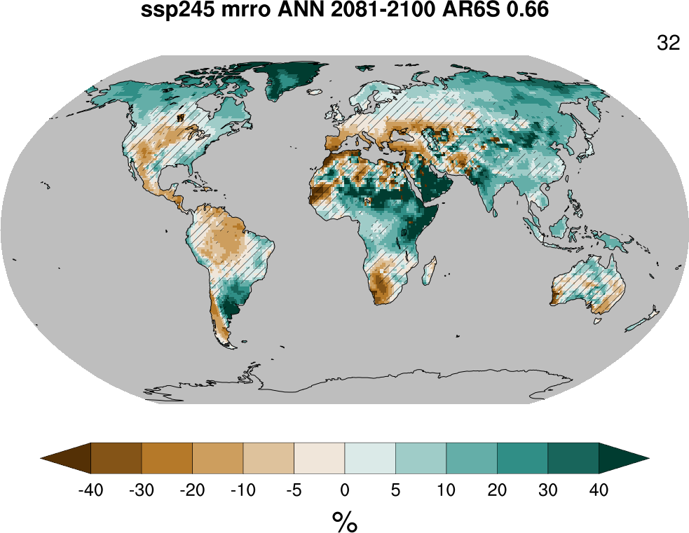

Short cut
----------
If you are in the lucky case where :

- you have access to the `ESPRI <https://en.aeris-data.fr/espri-2/>`_ platform
- that platform still hosts user 'ssenesi'
- you have a simple need for a change map

you can create a map of the change in variable ``mrro`` for season
``ANN`` in projection ``ssp245`` between periods 1995-2014 and
2081-2100, using the confidence/hatching scheme ``AR6S`` (which refers
to the AR6 simple scheme) with threshold value 0.66 by typing :

.. code-block:: bash

   export CLIMAF=/home/ssenesi/climaf_installs/climaf_running
   export CAMMAC=/data/ssenesi/CAMMAC
   $CAMMAC/jobs/basic.sh ssp585 JJAS KS 0.9 pr

This uses notebook :download:`basic </../html_nb/basic.html>` and
should create a sub-directory 'basic_mrro_ssp245_ANN_AR6S_0.66'
hosting this figure :

You can also copy and edit script :download:`basic.sh
</../../jobs/basic.sh>` for changing more driving parameters.

Note that parameters included in
:download:`$CAMMAC/jobs/common_parameters.yaml
</../../jobs/common_parameters.yaml>` are take into account, but with
a lower priority than those set in the script itself

If user 'ssenesi' has been removed, you should reach the same results
by first getting CAMMAC source using only the :ref:`code cloning
instructions <cloning>` of the installation section

If you have other needs, have may a look at :ref:`available_notebooks` and
:ref:`batch_mode`

If you don't have access to the `ESPRI
<https://en.aeris-data.fr/espri-2/>`_ platform, you will need :

- to have CMIP6 data locally available
- possibly, to tell CliMAF how to access it (see :ref:`adapting_for_data`)
- to go through :ref:`installation`
